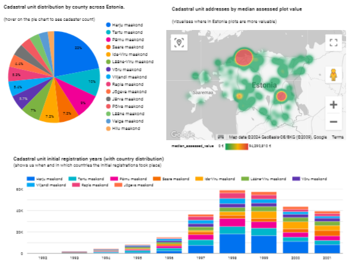
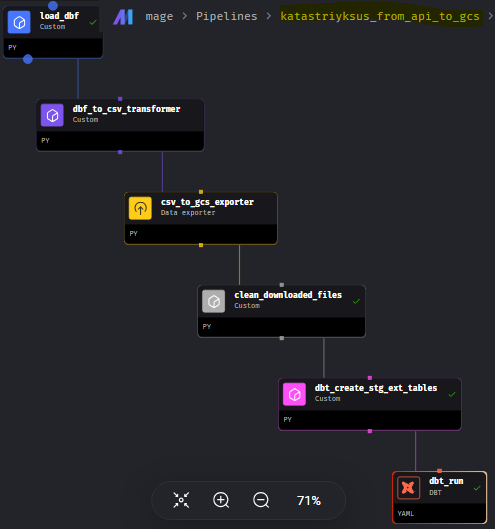
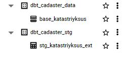

## Introduction

This is data engineering project to load, transform and visualize the Estonian cadastral data.

Processing type: BATCH

	Cadastral Data (definition): contains official, legal documentation concerning the quantity, dimensions, location, value, tenure, and ownership of individual parcels of land.

PROBLEM: 
Understand the Estonian cadastral data by visualizing:
- cadastral unit distribution by county across Estonia
- cadastral unit initial registrations over time (timeline)
- cadastral unit addresses on a heat map by median assessed plot value

## Dashboard
Build with Looker Studio, on the Bigquery cadaster base table:


Explore it here:

https://lookerstudio.google.com/reporting/d3349042-e744-4985-bac3-c0368df50e6a 


## Architecture

Technologies used:
- **Python**
- **Docker**/docker-compose
- **Terraform** as IaaC
- **Mage** for orchestration
- **Google Cloud Storage** as data lake
- **BigQuery** & **dbt** core
- **Looker Studio** as viz dashboard
 


## Pipeline

#### There is one source file and one pipeline defined.

#### **Mage** pipeline "**katastriyksus_from_api_to_bq**" blocks:



## DWH (Bigquery)

**"dbt run"** creates two schemas and tables in BigQuery: 

- "stg_katastriyksus_ext" : external table for staging the data from the csv file in GCS.
- "base_katastriyksus" : materialized base table for storing the transformed data & using it for reporting. 
  
	- partitoned_by: **registration_date_year** - since this column is used to create the timeline chart in the dashboard.
	- clustered_by: **county_name** - column used for grouping in the chart, dashboard. 



## Steps to get the project up and run the pipeline:

### Prerequisites

##### Google Cloud:
- Create a project (get a project_id) 
  
- Enable Identity and Access Management (IAM) API in google cloud platform: 
	https://console.cloud.google.com/apis/library/iam.googleapis.com?
- Enable Cloud Resource Manager API:
	https://console.cloud.google.com/apis/api/cloudresourcemanager.googleapis.com 

##### On the machine you're using:
- Terraform installed
- docker installed and running
- docker-compose installed

### Setup:
1. clone the project in your desider machine, or VM instance: 
   
   ```git clone https://github.com/KrisSert/cadaster-ee.git```

2. Create service account manually (w role: "OWNER") and api key for terraform in GCS.
	- download the JSON and place the value to /terraform/keys/gcs_terraform_api_key.json"
  
	If the path does not exist, create it:
  
	```mkdir cadaster-ee/terraform/keys```

	Make sure to rename the pasted api key to:
	
		"gcs_terraform_api_key.json"

3. To create GCS infrastructure (bucket, bigquery dataset, service accounts, roles):
   - navigate from project root "**cadaster-ee**" to path "terraform":
  
		```cd terraform```
	
   - run terraform init, plan & apply: 

		```terraform init``` 
  	
		``` terraform plan```  
		(to_be_created: 6 to add.)

		```terraform apply```

4. Create the api keys for "mage-service-account" and "dbt-service-account" here:
   	https://console.cloud.google.com/iam-admin/serviceaccounts

	- the mage-service-account api key should be placed in "/keys" folder in the project, and renamed to:
		"mage_service_account_key.json"
	- the dbt-service-account api key should be placed in "/keys" folder in the project, and renamed to:
		"dbt_service_account_key.json"

5. add the google project_id for dbt. In project root:

	make sure to replace <your_project_id> with you google project_id as mentioned above in the "prerequisites > google cloud" section.

	```sed -i 's/de-zoomcamp-411619/<your_project_id>/g' mage/dbt/profiles.yml```

	```sed -i 's/de-zoomcamp-411619/<your_project_id>/g' mage/dbt/models/staging/schema.yml```

6. in the project root "**cadaster-ee**", run:
	```docker compose up --build```

	Give it some time to download the images, and build the container.

7. Once done, access the mage container, and run "**dbt deps**":
   
   ```docker exec -it <container_id> bash```

   ```cd /home/src/mage/dbt```

   ```dbt deps```

   ctrl+c to exit

8. 	Access mage at:
	
	- if running docker locally:
		//localhost:6789

	- if using cloud vm: 
		http://[vm_external_ip]:6789

	Go to triggers, and pick either the scheduled or one-time trigger & run.
	Takes 20-30 to complete, mostly due to ".bdf to .csv" conversion.
	The underlying dataset is updated every midnight estonian time - scheduled trigger set to 01:00 each night.