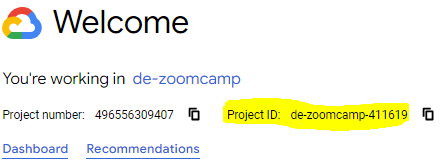

## Introduction

This is data engineering project to load, transform and visualize the Estonian cadastral data.

Processing type: BATCH

	Cadastral Data (definition): contains official, legal documentation concerning the quantity, dimensions, location, value, tenure, and ownership of individual parcels of land.

PROBLEM: 
Understand the Estonian cadastral data by visualizing:
- cadastral unit distribution by county across Estonia
- cadastral unit initial registrations over time (timeline)
- cadastral unit addresses on a heat map by median assessed plot value

## Dashboard
Build with Looker Studio, on the Bigquery cadaster base table:


Explore it here:

https://lookerstudio.google.com/reporting/d3349042-e744-4985-bac3-c0368df50e6a 

Note: In the google map view, you have to zoom into Estonia, since there are some false positives in the address data, where address names are similar to other places in the world :)

## Architecture

Technologies used:
- **Python**
- **Docker**/docker-compose
- **Terraform** as IaaC
- **Mage** for orchestration
- **Google Cloud Storage** as data lake
- **BigQuery** & **dbt** core
- **Looker Studio** as viz dashboard
 


## Pipeline

Source (Cadastral units SHP file): https://geoportaal.maaamet.ee/eng/spatial-data/cadastral-data-p310.html

#### There is one source file and one pipeline defined.

#### **Mage** pipeline "**katastriyksus_from_api_to_bq**" blocks:


## DWH (Bigquery)

**"dbt run"** creates two schemas and tables in BigQuery: 

- "stg_katastriyksus_ext" : external table for staging the data from the csv file in GCS.
- "base_katastriyksus" : materialized base table for storing the transformed data & using it for reporting. 
  
	- partitoned_by: **registration_date_year** - since this column is used to create the timeline chart in the dashboard.
	- clustered_by: **county_name** - column used for grouping in the chart, dashboard. 


## Steps to get the project up and run the pipeline:

### Prerequisites

##### Google Cloud:
- Create a project (get a project_id) 
  

- Enable bigquery api: https://console.cloud.google.com/marketplace/product/google/bigquery.googleapis.com 
- Enable Identity and Access Management (IAM) API in google cloud platform: 
	https://console.cloud.google.com/apis/library/iam.googleapis.com?
- Enable Cloud Resource Manager API:
	https://console.cloud.google.com/apis/api/cloudresourcemanager.googleapis.com 

##### On the machine you're using:
- Terraform installed
- docker/docker-compose installed and running

### Setup:
1. clone the project in your desired machine, or VM instance: 
   
   ```git clone https://github.com/KrisSert/cadaster-ee.git```

2. change the project variables (google cloud project_id & bucket_name) used in *"terraform/variables.tf"*. From project root:
   
   Since the bucket names in google cloud have to be globally unique, please change it to some bucket name which most likely does not already exists, for example *"cadaster_bucket_102937"* or something similar with plenty digits.

   ```sed -i 's/de-zoomcamp-411619/<your_project_id>/g' terraform/variables.tf```

   ```sed -i 's/cadaster_data_bucket/<your_bucket_name>/g' terraform/variables.tf```
   
3. add the google project_id and bucket_name for dbt. In project root:

	make sure to replace <your_project_id> with you google project_id as mentioned above in the "prerequisites > google cloud" section. 

	```sed -i 's/de-zoomcamp-411619/<your_project_id>/g' mage/dbt/profiles.yml```

	```sed -i 's/de-zoomcamp-411619/<your_project_id>/g' mage/dbt/models/staging/schema.yml```

	same goes for <your_bucket_name>:

	```sed -i 's/cadaster_data_bucket/<your_bucket_name>/g' mage/dbt/models/staging/schema.yml```

	```sed -i 's/cadaster_data_bucket/<your_bucket_name>/g' mage/data_exporters/csv_to_gcs_exporter.py```

4. Create service account for terraform manually (w role: "OWNER"):
   
	- Create json api key for the service account.
  
	- from project root, create keys path under terraform:

		```mkdir cadaster-ee/terraform/keys```
	
	- download the JSON api key and place the value to 
  
		```cadaster-ee/terraform/keys/gcs_terraform_api_key.json"```
  
	Make sure that the pasted api key is renamed to:
	
		"gcs_terraform_api_key.json"

5. To create GCS infrastructure (bucket, service accounts, roles):
   - navigate from project root "**cadaster-ee**" to path "terraform":
  
		```cd terraform```
	
   - run terraform init, plan & apply: 

		```terraform init``` 
  	
		``` terraform plan```  
		(to_be_created: 6 to add.)

		```terraform apply```

6. Create the api keys for "mage-service-account" and "dbt-service-account" here:
   	https://console.cloud.google.com/iam-admin/serviceaccounts

	- create the keys path in project root (cadaster-ee): 
  
		```mkdir keys```

	- the mage-service-account api key should be placed in "/keys" folder in the project, and renamed to:
		"mage_service_account_key.json"
	- the dbt-service-account api key should be placed in "/keys" folder in the project, and renamed to:
		"dbt_service_account_key.json"


7. in the project root "**cadaster-ee**", run:
	```docker compose up --build```

	Give it some time to download the images, and build the container.

8. Once done, access the mage container, and run "**dbt deps**":
   
   ```docker exec -it <container_id> bash```

   ```cd /home/src/mage/dbt```

   ```dbt deps```

   ctrl+d to exit

9. Access mage:
	
	- if running docker locally:
		//localhost:6789

	- if using cloud vm (make sure to create a firewall rule that enables access under Google Cloud > VPC firewall rules > create firewall rule:
   
		http://[vm_external_ip]:6789

	Go to triggers, and pick either the scheduled or one-time trigger & run.
	
	Took 2 min 30 sec to complete on Google Cloud VM.

	The underlying dataset is updated every midnight estonian time - scheduled trigger set to 01:00 each night.